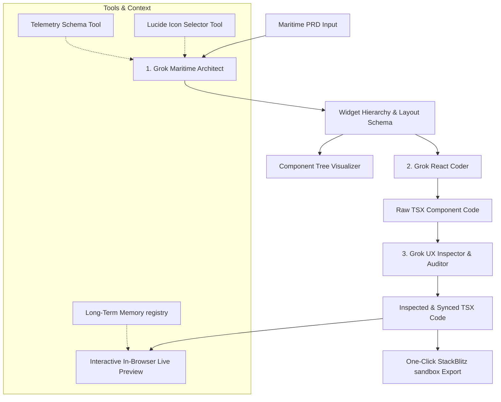

# BridgeView AI ⚓
### ThinkPalm Maritime Product Requirements Agentic Pipeline

BridgeView AI is an AI-powered software engineering accelerator designed for ThinkPalm engineers. It converts complex maritime Product Requirements Documents (PRDs) into interactive React dashboards built with TypeScript, Tailwind CSS, and Lucide icons. 

The application utilizes a collaborative multi-agent pipeline powered by Grok 3 to perform structural analysis, synthesize production-ready code, run quality control audits, and export functional developer workspaces to StackBlitz with a single click.

---

## 🚀 Key Features

* **Pastes Maritime Specs to UI**: Paste any maritime spec (such as a Vessel Monitoring System, Fuel Optimizer, Ballast Level system, or Crew Watch Portal) and watch the pipeline build a dashboard for it.
* **Collaborative Multi-Agent Pipeline**:
  1. **Maritime Architect Agent**: Analyzes specifications and designs a widget hierarchy, layout grid, and telemetry configurations.
  2. **React Coder Agent**: Synthesizes a pixel-perfect, interactive, responsive React components tree styled with glassmorphic Tailwind CSS variables.
  3. **UX Inspector & Auditor Agent**: Automatically conducts JSX verification, lints components, and validates syntax structure.
* **Component Tree Hierarchy Visualizer**: Real-time rendering of the generated React widget tree, props list, and state management hooks.
* **Live In-Browser Preview**: Render and interact with the generated React dashboard inside the client browser. Control telemetry sliders (e.g. RPM / fuel rate), select propulsion modes, and acknowledge active critical alarms in real time.
* **Code Exporter**: View syntax-highlighted React source code and copy or download it.
* **StackBlitz SDK Integration**: Instantly bundle the generated code into a full, pre-configured Vite + Tailwind v4 + TypeScript workspace and launch it in StackBlitz with one click.
* **Telemetry Schema Tooling**: Seamlessly registers ship type context mapping keywords like "oil tanker," "crew welfare," or "ballast" to recommended data metrics.
* **Long-Term Memory Persistence**: Retains previous dashboard layouts and telemetry parameters across browser sessions using local storage registries.

---

## 🛠️ Architecture Flow



---

## 📦 Tech Stack

* **Framework**: React + TypeScript + Vite
* **Styling**: Tailwind CSS + Glassmorphic UI Tokens + Lucide Icons
* **Orchestrator LLM**: xAI Grok 3 API
* **Integration**: StackBlitz SDK (WebContainers)
* **Storage**: Browser LocalStorage (Memory Registry)

---

## 💻 Setup & Local Development

### Prerequisites
* [Node.js](https://nodejs.org/) (v18+ recommended)
* [npm](https://www.npmjs.com/)
* xAI Grok API Key (Required for live generation).

### Steps
1. **Clone the Repository**:
   ```bash
   git clone https://github.com/[YOUR-USERNAME]/thinkpalm-agent_ai-bridge_view_ai.git
   cd thinkpalm-agent_ai-bridge_view_ai
   ```

2. **Install Dependencies**:
   ```bash
   npm install
   ```

3. **Start Local Server**:
   ```bash
   npm run dev
   ```
   Open `http://localhost:5173` in your browser.

4. **Grok Configuration**:
   * Click **⚙️ Grok Settings** in the Requirements section.
   * Paste your Grok API Key (`xai-...`) to enable live multi-agent generation.

---

## 📹 Demo Video & Presentation

* **Demo Video Link**: [Insert Loom / YouTube Link Here]
  *(An 8-minute walkthrough demonstrating requirements pasting, agent collaboration logs, component tree traversal, interactive widget states, and the export flow to StackBlitz).*

---

## 📝 Sample PRD Specifications Included

* **Vessel Fuel & Speed Optimizer**: Analyzes cargo ship speed, fuel consumption flow rates, specific fuel consumption curves, and eco-modes.
* **Crew Welfare & Watch Portal**: Monitors crew personnel rest-hour compliance, safety incidents log, on-duty status, and fresh water storage levels.
* **Ballast Water & Tank Level Indicator**: Displays real-time ballast pump controls, water level indicators, vessel roll angles, and alarm status panels.
